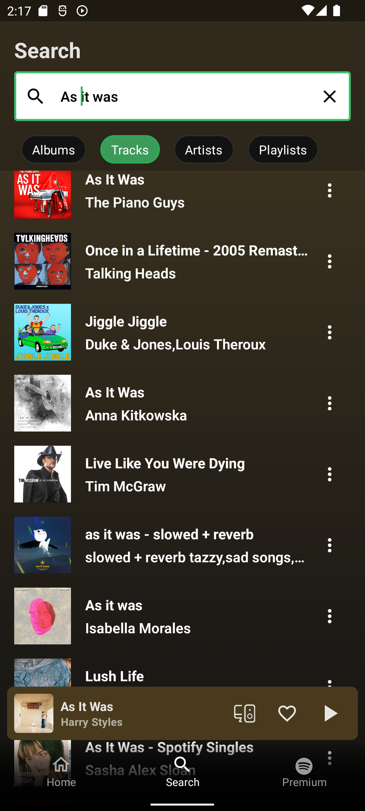
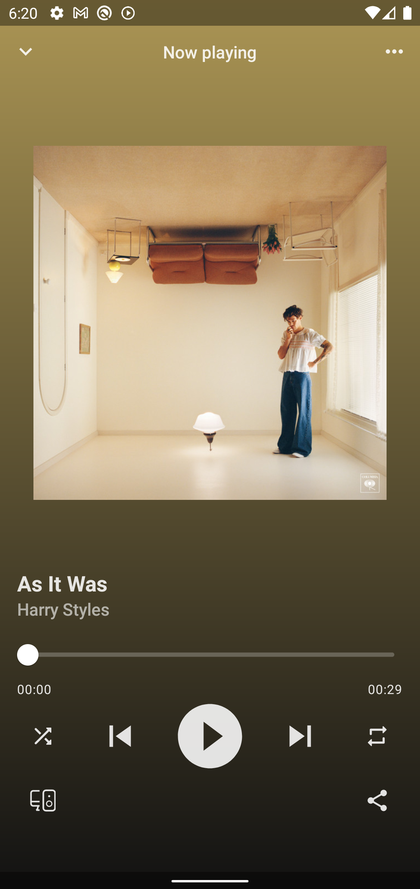
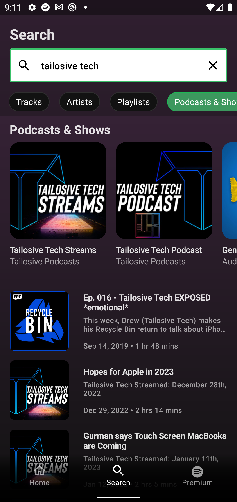

# Musify

Musify is a clone of the popular Spotify app built completely using Jetpack compose. Both podcasts episodes and tracks are available for playback. Under the hood, it uses the Spotify API to fetch the data. It is 
completely built using Jetpack compose. It is also worth noting that it is not a complete one-on-one clone of the app. It can be considered as an app 
that is heavily inspired by the design of the official Spotify app with some custom design tweaks. It uses many API’s such as Hilt,Retrofit, and Paging 3. I built this project purely for educational purposes. I neither intend to release, nor do I plan on monetizing any part of this project. 

## Table of contents
1. [Demo](#demo)
2. [Screenshots](#screenshots)
3. [Tech Stack](#tech-stack)
4. [Notable features](#notable-features)
5. [Source code, Architecture, & Testing](#source-code-architecture--testing)

## Demo
https://user-images.githubusercontent.com/54663474/218087723-0bf43793-3ff4-4e24-934e-37725e5cd248.mp4

## Screenshots
 &nbsp;  &nbsp;  
## Podcasts
 &nbsp;  &nbsp; 
## Tech Stack
- Entirely written in [Kotlin](https://kotlinlang.org/).
- [Hilt](https://www.google.com/url?client=internal-element-cse&cx=000521750095050289010:zpcpi1ea4s8&q=https://developer.android.com/training/dependency-injection/hilt-android&sa=U&ved=2ahUKEwiW5omeu6z4AhWRR2wGHVUsCo0QFnoECAMQAQ&usg=AOvVaw3dCbP79C6od3KVCnJub3v0) for dependency injection.
- [Jetpack Compose](https://developer.android.com/jetpack/compose) for UI and navigation.
- [Kotlin Coroutines](https://kotlinlang.org/docs/reference/coroutines/coroutines-guide.html) for threading.
- [Accompanist placeholders](https://google.github.io/accompanist/placeholder/).
- [Coil compose](https://coil-kt.github.io/coil/compose/) for image loading and caching.
- [Lottie compose](https://github.com/airbnb/lottie/blob/master/android-compose.md) for displaying animated resources such as a custom loading animation.
- [Mokito-Kotlin](https://github.com/mockito/mockito-kotlin) for mocking dependencies in unit tests.
- [Retrofit](https://square.github.io/retrofit/) for communicating with the Spotify API.
- [Hilt](https://www.google.com/search?client=safari&rls=en&q=Hilt&ie=UTF-8&oe=UTF-8) for dependency injection.
- [Exoplayer](https://exoplayer.dev) for background playback and music controls.
- [Paging 3](https://developer.android.com/topic/libraries/architecture/paging/v3-overview) for pagination.
- [Google's palette api](https://developer.android.com/develop/ui/views/graphics/palette-colors) for color extraction from image.
- [Kotlin Flows](https://developer.android.com/kotlin/flow) for creating reactive streams.
- [Java 8 Date/Time API](https://www.oracle.com/technical-resources/articles/java/jf14-date-time.html) for dealing with date and time.

## Notable features

<dl>
  <dt> Global Playback state ▶️ </dt>
  <dd> The currently playing track gets highlighted in any screen that contains the currently playing track. This is achieved by maintaining a global playback state. Once the currently playing state changes, it will be notified to all the screens. </dd>
  <dt> Dynamic theme 🎨 </dt>
  <dd>This app uses Google’s Palette API to fetch the background color of the screens based on an image. For example, the album art associated with the first search result determines the background gradient color of the search screen.</dd>
  <dt> Specific error messages ⚠️ </dt>
  <dd> When there is an error, the app will try to be as specific as possible. For example, if no tracks are found for a particular search query, then it’ll be specific and state that no “tracks” where found instead of displaying a generic “no results found” message. This applies for the rest of the app as well. In certain cases, it even provides a retry button. </dd>
  <dt> Insets ⌨️ </dt>
  <dd> The app uses insets to ensure that the content of the screen doesn't get overlaid by system views. It even accomondates the UI for the IME (on screen keyboard). For example, in the search screen, the loading animation will be moved up when the on screen keyboard appears.</dd>
  <dt> Time & Locale based in-app content 🕐 </dt>
  <dd> The content displayed in the home screen is based on the current time and locale associated with the user's device. This is made possible because the Spotify API allows the specification of timestamp and locale as query parameters. </dd>
  <dt> Backstack management 🗂 </dt>
  <dd> The app ensures that the backstack is properly managed. By poping upto, but not including the Home Screen everytime the user navigates to a bottom naivgation destination, the number of destinations in the backstack gets reduced. This imporves the overall UX of the app. </dd>
  <dt> Attention to tiny details 🔍 </dt>
  <dd> The app was built with an attention to even the tiniest of details. These features might seem trivial, but it affects the UX negatively if they are not present. The app tries to mimic such functionality even though they might get unnoticed in order to immitate the features that the app would need, if it were to be officially released. The following are some of the many UX improving features that the app has.  
  
  - The clear button of the search bar in the search screen will only appear if there is text within it. It also uses a subtle animation while entering/exiting.
- If the user is inside a nested navigation destination associated with a bottom navigation destination, and taps on the bottom navigation icon, the backstack would be popped.
- Plural strings are used to display gramatically correct text. This can be specifically seen in the metadata of podcast episodes where the date and duration strings are formatted in a gramatically corrected manner. For example, an episode that has a duration of 1 hour is displayed as '1 hr', whereas an episode that has a duration of 2 or more hours, is displayed with 'hrs' as a suffix. 
   </dd>
  <dt> HTML styled text🖌</dt>
  <dd> The app leverages compose-view interop to display html styled text. It's mainly used in the descriptions of the podcast show/episode detail screens. This means, these textfields can display text in different styles, such as italics and bold. Moreover, since the text is html styled, it can even display text in other forms such as lists. The URLs in the descriptions are even clickable, allowing the user to navigate to a linked website. </dd>
   <dt> Additional features 🎄 </dt>
   <dd> As of writing this, the IOS version of the official Spotify app uses a dynamic background color in the search screen. The Android version of the app doesn't have that feature. The Musify app mimics that feature by using a dynamic background color for the search screen. </dd>
</dl>

## Source code, Architecture, & Testing
- All concrete implementations are prefixed by the term "Musify".
- Uses multi-repository pattern.
- MVVM archtecture.
- Commit messages follow the [Conventional Commits](https://www.conventionalcommits.org/en/v1.0.0/) specification.
- Consists of extensive unit tests with a predominant focus on testing the data layer.
- An illustration depicting the setup of the navigation graph can be found [here](https://github.com/t3chkid/Musify/tree/main/app/src/main/java/com/example/musify/ui/navigation).
